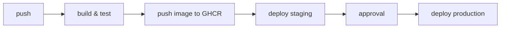

# EcoFlow ESG

API REST para gerenciamento de coletores, ordens de coleta e alertas, com autenticação JWT e persistência em Oracle.

Visão geral, containerização e pipeline CI/CD para o desafio DevOps.

--

## Diagrama do fluxo (Mermaid)



--

## Estrutura de pastas (resumida)

```
.
├── .github/workflows/ci-cd.yml
├── docker/
│   └── oracle/init/01-create-ecoflow-user.sql
├── scripts/deploy.sh
├── src/
├── Dockerfile
├── docker-compose.yml
├── docker-compose.staging.yml
├── docker-compose.prod.yml
├── .env.example
├── .dockerignore
├── .gitignore
└── README.md
```

--

## Containerização

O `Dockerfile` é multi-stage:
- Stage `build`: usa `eclipse-temurin:25-jdk`, roda `./mvnw dependency:go-offline` e `./mvnw clean package -DskipTests` para gerar o JAR.
- Stage `runtime`: usa `eclipse-temurin:25-jre`, instala `curl` e cria um usuário não-root `ecoflow`; copia o JAR para `/app/app.jar` e cria `/app/logs`.

Volumes, redes e variáveis usadas:

| Recurso | Uso |
|---|---|
| Volume `oracle-data` | Persistência dos dados do Oracle (docker-compose.yml) |
| Volumes `api-logs*` | Logs da aplicação (`/app/logs`) |
| Rede `ecoflow-net*` | Rede bridge para comunicação entre api e oracle |
| Variáveis | `SPRING_DATASOURCE_URL`, `SPRING_DATASOURCE_USERNAME`, `SPRING_DATASOURCE_PASSWORD`, `JWT_SECRET`, `IMAGE_NAME`, `IMAGE_TAG` |

--

## Executando localmente

1. Copie o exemplo de variáveis e ajuste: `cp .env.example .env`
2. Suba os serviços em background (development):

```bash
docker compose up -d --build
```

3. Aguarde até o Oracle inicializar — monitore com `docker logs -f ecoflow-oracle` até `DATABASE IS READY TO USE!`.

4. Verifique a API:

```bash
curl -fs http://localhost:8080/actuator/health
```

--

## Pipeline CI/CD (resumo)

Jobs definidos em `.github/workflows/ci-cd.yml`:

| Job | Quando roda | O que faz |
|---|---|---|
| build-test | push / PR (main, develop) | Checkout, JDK25, `./mvnw -B verify`, upload de artefatos |
| docker | push | build e push para GHCR (tags: sha + latest/staging) |
| deploy-staging | push | copia arquivos para servidor staging e executa `scripts/deploy.sh` |
| deploy-production | push para main | copia arquivos para servidor production e executa `scripts/deploy.sh` (requer aprovação) |

--

## Configuração do GitHub

Crie os Environments `staging` e `production` e adicione as variáveis `STAGING_URL` / `PRODUCTION_URL`.
Marque `production` com Required reviewers.

Secrets necessários (exemplos):

- STAGING_HOST, STAGING_USER, STAGING_SSH_KEY
- PROD_HOST, PROD_USER, PROD_SSH_KEY
- DB_USER, STAGING_DB_PASSWORD, STAGING_ORACLE_SYS_PASSWORD, STAGING_JWT_SECRET
- PROD_DB_PASSWORD, PROD_ORACLE_SYS_PASSWORD, PROD_JWT_SECRET

--

## Evidências


--

## Link do repositório e integrantes

Repositório: (adicione o link aqui)

Integrantes:
- Mariana Eslan
- Lucas Félix
- Gabriel Forte
